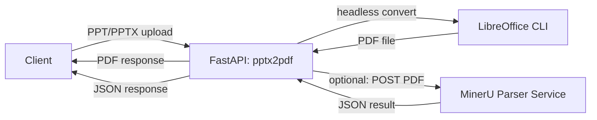

# pptx2pdf

FastAPI service that converts PPT/PPTX to PDF using LibreOffice. Optional chaining to a downstream PDF parser service is supported.

## Requirements

- Python 3.11+
- LibreOffice (CLI available)
  - macOS: `/Applications/LibreOffice.app/Contents/MacOS/soffice`
  - Linux: `libreoffice` or `soffice` on PATH

## Architecture



## Quick start

```bash
python -m venv .venv
source .venv/bin/activate
pip install -r requirements.txt
uvicorn app:app --host 0.0.0.0 --port 1888
```

## Endpoints

- `GET /healthz` – basic health check
- `POST /convert` – upload PPT/PPTX, returns PDF
- `POST /convert_multipart` – upload PPT/PPTX, returns multipart response with a single PDF field
- `POST /convert_and_parse` – upload PPT/PPTX, returns downstream parser JSON

## Usage examples

Convert PPTX to PDF:
```bash
curl -o output.pdf \
  -F "file=@/path/to/slides.pptx" \
  http://localhost:1888/convert
```

Convert PPTX to PDF and parse with external parser:
```bash
curl -F "file=@/path/to/slides.pptx" \
  http://localhost:1888/convert_and_parse
```

Override parser URL per request:
```bash
curl -F "file=@/path/to/slides.pptx" \
  "http://localhost:1888/convert_and_parse?parser_url=http://parser-host:port/file_parse"
```

## Configuration

Environment variables:

- `SHOW_DOCS` – set to `true` to enable Swagger docs
- `LOG_LEVEL` – logging level, e.g. `INFO`, `DEBUG`
- `PARSER_URL` or `PARSE_URL` – default downstream parser URL
- `LIBREOFFICE_BIN` or `LIBREOFFICE_PATH` – full path to LibreOffice binary

## Notes

- `--host 0.0.0.0 --port 1888` controls **this** service only.
- The parser service is separate. If you do not run a parser, use `/convert`.
